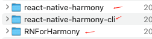
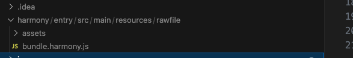

这是一个 ReactNative 项目, 为了测试 RN 接入鸿蒙系统而创建

- VScode Version: 1.87.0 (Universal)
- ReactNative 版本: 0.72.5 


## 2024-03-15 RN 接入鸿蒙 SDK

步骤
1. 添加鸿蒙工具到 RNForHarmony 工程同级目录下 (因保密需求,相关资料无法上传)

   

2.  在 package.json 文件中引入鸿蒙工具

```json
 "dependencies": {
    "react": "18.2.0",
    "react-native": "0.72.5",
    ...
    "react-native-harmony": "file:../react-native-harmony/rnoh-react-native-harmony-0.72.13.tgz"
  }
```

3. 替换接入文档中的其他文件, 主要是一些 UI 页面

4. 构建 harmony.bundle.js 包
- 执行 `yarn install` 安装依赖包
- 执行 `yarn dev` 构建 Bundle 包: 得到 bundle.harmony.js

  

  其中 `yarn dev` 是配置在 package.json 中的脚本

  ```json
    "scripts": {
      "android": "react-native run-android",
      "ios": "react-native run-ios",
      "lint": "eslint .",
      ...
      "dev": "react-native bundle-harmony --dev"
    },
  ```
  `bundle-harmony` 命令依赖于第二步配置的工具


## 2024-04-01 Bridge

### RN 侧

- 在 React Native 0.70.0 之后, RN 与 Native 通信改为 `TurboModule`

1. 自定义 TurboModule [SampleTurboModule](./pages/bridge/rn_call_native/SampleTurboModule.tsx)

2. RN 调用相关方法 [RnCallNative](./pages/bridge/rn_call_native/RnCallNative.tsx)


### 鸿蒙侧 

鸿蒙侧改动见 [HarmonyForRN](https://github.com/HeCaser/HarmonyForRN)